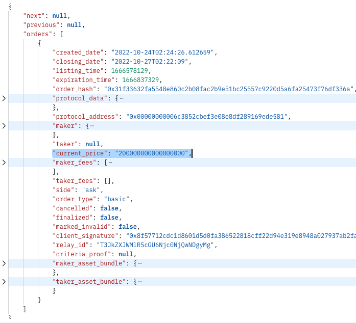
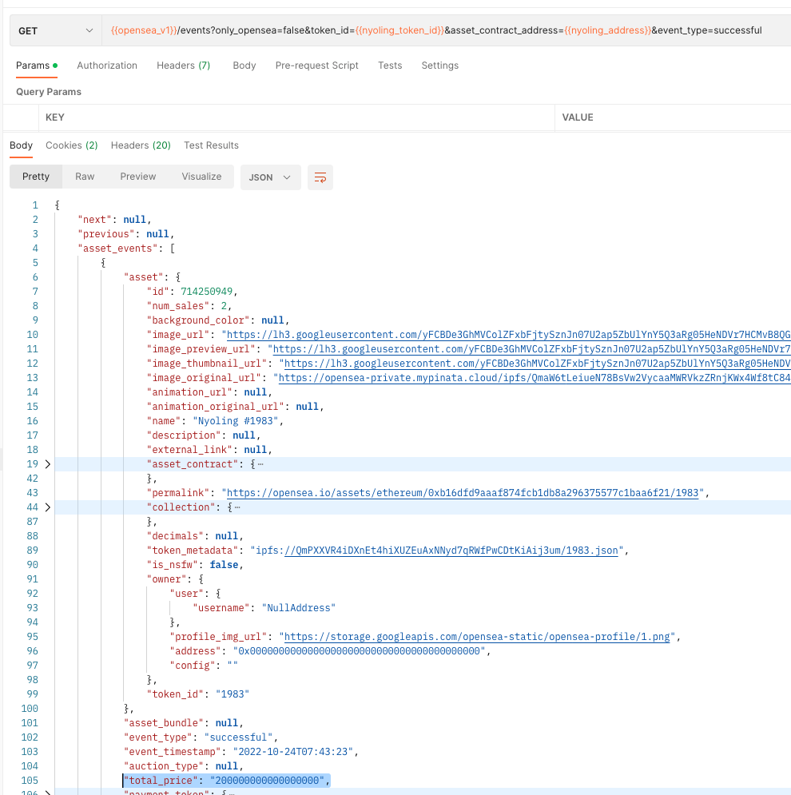

## NFT Explore

### Collections list
- Trending collection
- Filter by Volume, Average price, Sale count

### Collection Items list
- Sort
    - Mint date
    - Created date
    - Last sale date
    - Last sale price
    - Last transaction date

#### URL

##### Opensea
```
{{opensea_v1}}/assets?asset_contract_address={{nyoling_address}}&limit=2&order_direction=desc
```
##### Icytools
Fetch with IcyTools


###  Details processing

- Add limit rate
- FE query: first 20 items come with full info
- BE query: all collection save to Redis (+ updated datetime) and MongoDB
- Send to queue the job to update collections and stats

### Background workers

#### Metadata processing

- For all new collections update metadata with blockdaemon
`{{BLOCKDAEMON_NFT_URL_REST}}/collection?contract_address={{nyoling_address}}`
Example response:
```
"meta": {
    "discord_url": "https://discord.gg/3P5K3dzgdB",
    "external_url": "http://www.boredapeyachtclub.com/",
    "twitter_username": "BoredApeYC"
},
```

#### Dynamic props

- num_sales  (source: opensea, icy.tools logs)
- last_sale_date  (source: opensea, icy.tools)
- mint_date  (source: blockdaemon, icy.tools)
- current price (source: opensea, N/A)
- all time average price (source: opensea, icy.tools average price among orders)
- offers (source: opensea, N/A)
- events (opensea, blockdaemon, icy.tools)

##### Current price

###### Listings

Refresh time: 1 day

```
{{opensea_v2}}/orders/ethereum/seaport/listings?order_by=eth_price&order_direction=desc&token_ids={{nyoling_token_id}}&asset_contract_address={{nyoling_address}}
```

Example response:



###### No orders

When there are no orders, the price is the highest price from the list of offers.

How to receive current offers?

##### Mint date

###### Blockdaemon

Refresh time: Once, when created

```
{{BLOCKDAEMON_NFT_URL_REST}}/events?contract_address={{nyoling_address}}&token_id={{nyoling_token_id}}&event_type=mint
```

###### Icy.Tools

Fetch logs with graphQL

##### All time average price

Using sale events and calculating the average

```
{{opensea_v1}}/events?only_opensea=false&token_id={{nyoling_token_id}}&asset_contract_address={{nyoling_address}}&event_type=successful
```



#### Item info response

- TokenID
- Blockdaemon ID (UUID)
- OpenSea ID (id)
- Contact address
- Image URL (image_url, image_preview_url, image_thumbnail_url)
- Symbol
- Dynamic props

#### Item info response from Opensea:

```json
{
  "next": "LXBrPTcyMDc1NjYwNA==",
  "previous": null,
  "assets": [
    {
      "id": 720756633,
      "num_sales": 5,
      "background_color": null,
      "image_url": "https://lh3.googleusercontent.com/8VqjqC_ydJgnrR5-7RQ7TO9pBX9vThFwz0j1XHQQK6FIqaX16O6s-7wO_FydJYFOqakVMVh8UCAvjOJbl40L_8yOushQeMOLVoJo",
      "image_preview_url": "https://lh3.googleusercontent.com/8VqjqC_ydJgnrR5-7RQ7TO9pBX9vThFwz0j1XHQQK6FIqaX16O6s-7wO_FydJYFOqakVMVh8UCAvjOJbl40L_8yOushQeMOLVoJo=s250",
      "image_thumbnail_url": "https://lh3.googleusercontent.com/8VqjqC_ydJgnrR5-7RQ7TO9pBX9vThFwz0j1XHQQK6FIqaX16O6s-7wO_FydJYFOqakVMVh8UCAvjOJbl40L_8yOushQeMOLVoJo=s128",
      "image_original_url": "https://opensea-private.mypinata.cloud/ipfs/QmaW6tLeiueN78BsVw2VycaaMWRVkzZRnjKWx4Wf8tC84b/7774.png",
      "animation_url": null,
      "animation_original_url": null,
      "name": "Nyoling #7774",
      "description": null,
      "external_link": null,
      "asset_contract": {
        "address": "0xb16dfd9aaaf874fcb1db8a296375577c1baa6f21",
        "asset_contract_type": "non-fungible",
        "created_date": "2022-10-13T15:58:50.437766",
        "name": "Nyolings",
        "nft_version": "3.0",
        "opensea_version": null,
        "owner": 534682939,
        "schema_name": "ERC721",
        "symbol": "NYOLINGS",
        "total_supply": "0",
        "description": "Nyolings is a collection of 7777 cute and loveable characters exploring the world on the Ethereum blockchain.",
        "external_link": "http://nyolings.io",
        "image_url": "https://i.seadn.io/gcs/files/26c3a14f0f9f2cbe6080d932a09870d0.png?w=500&auto=format",
        "default_to_fiat": false,
        "dev_buyer_fee_basis_points": 0,
        "dev_seller_fee_basis_points": 500,
        "only_proxied_transfers": false,
        "opensea_buyer_fee_basis_points": 0,
        "opensea_seller_fee_basis_points": 250,
        "buyer_fee_basis_points": 0,
        "seller_fee_basis_points": 750,
        "payout_address": "0x47ba1d0081053e97878af4f7943719c87d64bcaa"
      },
      "permalink": "https://opensea.io/assets/ethereum/0xb16dfd9aaaf874fcb1db8a296375577c1baa6f21/7774",
      "collection": {
        "banner_image_url": "https://i.seadn.io/gcs/files/8a5a8e0fe257d76e8366ad1b26094dcf.png?w=500&auto=format",
        "chat_url": null,
        "created_date": "2022-10-13T16:21:08.816386+00:00",
        "default_to_fiat": false,
        "description": "Nyolings is a collection of 7777 cute and loveable characters exploring the world on the Ethereum blockchain.",
        "dev_buyer_fee_basis_points": "0",
        "dev_seller_fee_basis_points": "500",
        "discord_url": "https://discord.gg/nyolings",
        "display_data": {
          "card_display_style": "contain"
        },
        "external_url": "http://nyolings.io",
        "featured": false,
        "featured_image_url": "https://i.seadn.io/gcs/files/79c5a4cf5631a8c10453f2d7b6786da3.jpg?w=500&auto=format",
        "hidden": false,
        "safelist_request_status": "verified",
        "image_url": "https://i.seadn.io/gcs/files/26c3a14f0f9f2cbe6080d932a09870d0.png?w=500&auto=format",
        "is_subject_to_whitelist": false,
        "large_image_url": "https://i.seadn.io/gcs/files/79c5a4cf5631a8c10453f2d7b6786da3.jpg?w=500&auto=format",
        "medium_username": null,
        "name": "Nyolings",
        "only_proxied_transfers": false,
        "opensea_buyer_fee_basis_points": "0",
        "opensea_seller_fee_basis_points": "250",
        "payout_address": "0x47ba1d0081053e97878af4f7943719c87d64bcaa",
        "require_email": false,
        "short_description": null,
        "slug": "nyolings",
        "telegram_url": null,
        "twitter_username": "Nyolings",
        "instagram_username": null,
        "wiki_url": null,
        "is_nsfw": false,
        "fees": {
          "seller_fees": {
            "0x47ba1d0081053e97878af4f7943719c87d64bcaa": 500
          },
          "opensea_fees": {
            "0x0000a26b00c1f0df003000390027140000faa719": 250
          }
        },
        "is_rarity_enabled": false
      },
      "decimals": null,
      "token_metadata": "ipfs://QmPXXVR4iDXnEt4hiXUZEuAxNNyd7qRWfPwCDtKiAij3um/7774.json",
      "is_nsfw": false,
      "owner": {
        "user": {
          "username": "NullAddress"
        },
        "profile_img_url": "https://storage.googleapis.com/opensea-static/opensea-profile/1.png",
        "address": "0x0000000000000000000000000000000000000000",
        "config": ""
      },
      "seaport_sell_orders": null,
      "creator": {
        "user": {
          "username": "NyolingsDeployer"
        },
        "profile_img_url": "https://storage.googleapis.com/opensea-static/opensea-profile/24.png",
        "address": "0x21f9dc672dc296da8815fac08ab02a9414f0c98b",
        "config": "verified"
      },
      "traits": [
        {
          "trait_type": "Hair",
          "value": "Dark Brown Stripes",
          "display_type": null,
          "max_value": null,
          "trait_count": 0,
          "order": null
        },
        {
          "trait_type": "Eyewear",
          "value": "Pink Round Sunglasses",
          "display_type": null,
          "max_value": null,
          "trait_count": 0,
          "order": null
        },
        {
          "trait_type": "Body",
          "value": "Tanned",
          "display_type": null,
          "max_value": null,
          "trait_count": 0,
          "order": null
        },
        {
          "trait_type": "Clothing",
          "value": "Tan Hoodie",
          "display_type": null,
          "max_value": null,
          "trait_count": 0,
          "order": null
        },
        {
          "trait_type": "Expression",
          "value": "Bored",
          "display_type": null,
          "max_value": null,
          "trait_count": 0,
          "order": null
        },
        {
          "trait_type": "Background",
          "value": "Blue",
          "display_type": null,
          "max_value": null,
          "trait_count": 0,
          "order": null
        }
      ],
      "last_sale": {
        "asset": {
          "decimals": null,
          "token_id": "7774"
        },
        "asset_bundle": null,
        "event_type": "successful",
        "event_timestamp": "2022-10-18T16:00:23",
        "auction_type": null,
        "total_price": "90000000000000000",
        "payment_token": {
          "symbol": "WETH",
          "address": "0xc02aaa39b223fe8d0a0e5c4f27ead9083c756cc2",
          "image_url": "https://openseauserdata.com/files/accae6b6fb3888cbff27a013729c22dc.svg",
          "name": "Wrapped Ether",
          "decimals": 18,
          "eth_price": "1.000000000000000",
          "usd_price": "1294.049999999999955000"
        },
        "transaction": null,
        "created_date": "2022-10-18T16:00:35.407118",
        "quantity": "1"
      }
    }
  ]
}
```

#### Background services

1. Fetch all collection items from the trending collections (first 1000 collections in background with lazy load, 20 collection with eager load)
2. Task queue with generic tasks (the function which is executed when received from queue)
3. Fetch dynamic properties

#### List of questions
- [] Is it possible to pass an Item to background channel?

## Tools

### Json to C# converter

https://json2csharp.com

### Git versioning

### Nerdbank.GitVersioning

The best docs are online:
https://github.com/dotnet/Nerdbank.GitVersioning/blob/master/README.md

## Backlog

#### Dependencies

1. Add Redis interface
2. Add Mongo interface
3. Add Clickhouse
4. Add Grafana
5. Add rate limits

#### Logic

1. Receive offers
2. Search box
3. To an item in collection add information about collection
4. Add metrics 
   - Endpoint route
   - Count request
   - Unique IP address